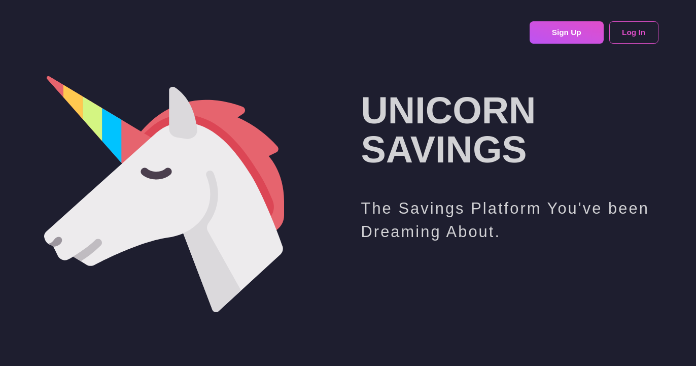
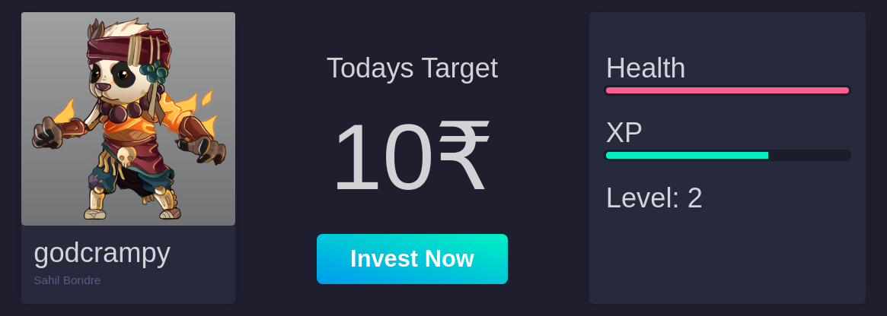
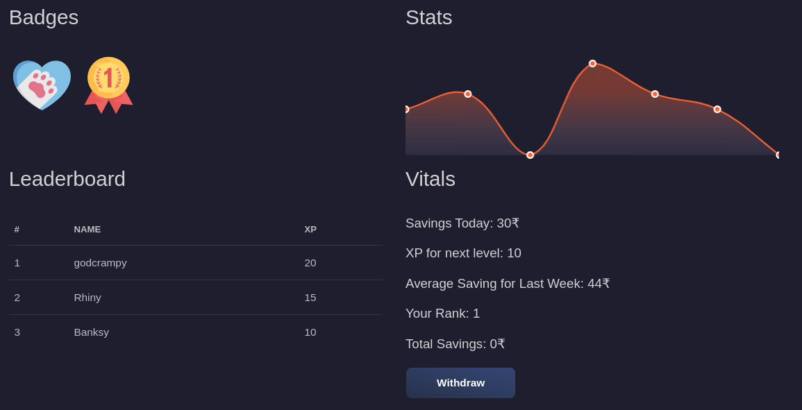

# Unicorn Savings 

Getting pocket money to survive the week and by the end with all the extras, well everyone just spends it mindlessly. This app will help you with the management of your savings and not in a boring way ofcourse. We are here with, Unicorn Savings, to gamify your experience with the savings management. 

### Prerequisites

1. Node (npm)
2. Yarn

## Installing

> Note : While building up your local copy on the system there are certain config files that are hidden from the user. However, one can easily continue with their own config. One major config is the firebase config, for back-end you must create a new project in firebase(name it as `unicorn-savings-<your username>`) and download its serviceAccountKey.json and paste it in the config file. Within the client side, you must require the firebase config for your app, hence you need to create an app first within your firebase project(name the app same as the project) and copy the config of the firebase sdk provided and paste it in `client/src/config`. Along with the firebase config you need to have an assets folder within `client/src` that will provide the assets for the project. One can message any of the contributors to get the copy of the assets.


To get a copy of the website running on your local system, proceed with the following steps: 

1. Clone the repository 

```
git clone https://github.com/Twelfth-Hour/unicorn-savings
```

2. Move to the directory and install yarn and format it. 

```
yarn install
yarn format
yarn start
```

3. Open a new terminal and move into the client directory using `cd client` and repeat the step 2.

```
yarn install
yarn format
yarn start
```

4. The website will run on `localhost:3000` with the back-end running on `localhost:5000`.

Create your virtual pet, enjoy the features, increase your xp and hp, earn badges. Don't forget to ever level up! Continue saving your money with our web-app `unicorn-savings`

## Demo 

* Landing Page 



* Profile & Statistics Page 




## Built With

* [Node](https://nodejs.org/en/docs/) - Node.js is an open-source, cross-platform, JavaScript runtime environment that executes JavaScript code outside of a browser.
* [React](https://reactjs.org/tutorial/tutorial.html) - React is a JavaScript library for building user interfaces.
* [React-Redux](https://react-redux.js.org/) - Redux is an open-source JavaScript library for managing application state.
* [Firebase](https://firebase.google.com/docs/) - Firebase is Google's mobile platform that helps you quickly develop high-quality apps and grow your business.

## Contributors

* **Aemie Jariwala** - [Aemie](https://github.com/AemieJ)
* **Sahil Bondre** - [Sahil](https://github.com/godcrampy)

